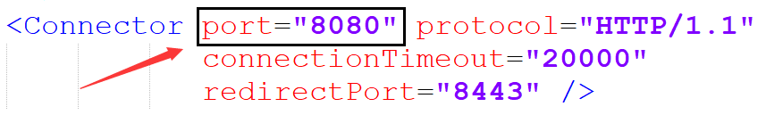

# JavaWeb

## Tomcat 简介

### Web 服务器

Web 服务器是一个应用程序，对 HTTP 协议的操作进行封装，使得程序员不必直接对协议进行操作，让 Web 开发更加便捷。可以将 Web 项目部署到服务器中，对外提供网上浏览服务。

### Tomcat

Tomcat 是一个轻量级的 Web 服务器，支持 Servlet/JSP 少量 JavaEE 规范，也称为 Web 容器，Servlet 容器。

## 软件部署

- 软件官方地址：[Apache Tomcat® - Welcome!](https://tomcat.apache.org/)

- 下载解压后，修改conf目录下 logging.properties 文件，将控制台编码格式改为 GBK

  ```properties
  java.util.logging.ConsoleHandler.encoding = GBK
  ```

## 基本使用

- 配置

  1. 修改启动端口号：修改 conf/server.xml 文件

     

     > 注：HTTP协议默认端口号为80，如果将Tomcat端口号改为80，则将来访问Tomcat时，将不用输入端口号

- 启动可能出现的问题

  1. 端口号冲突：找到对于程序，将其关闭掉
  2. 启动窗口一闪而过：检查 JAVA_HOME 环境变量是否正确配置