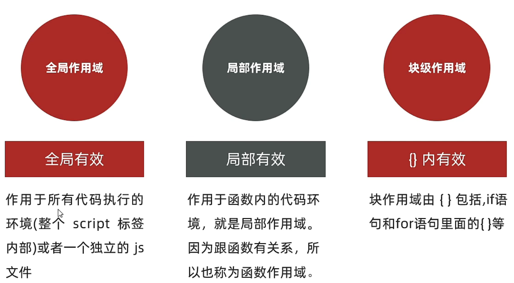
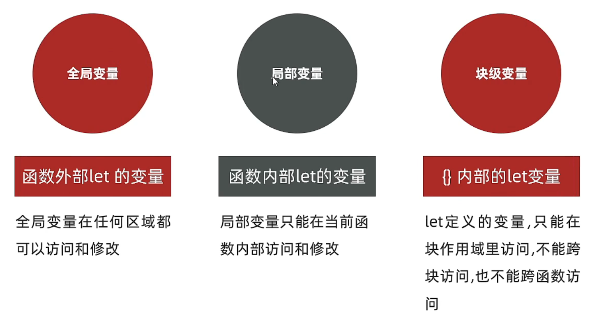

# JavaScript 

笔记整理顺序：

- [2022最新版JavaScript入门到精通，前端js全套基础&实战教程](https://www.bilibili.com/video/BV1Kq4y1e7d2)
- 

## JavaScript介绍

### JavaScript是什么

1. JavaScript是什么

   是一种运行在客户端（浏览器）的编程语言，实现人机交互效果。

2. JavaScript的作用

   - 网页特效(监听用户的一些行为让网页作出对应的反馈)
   - 表单验证(针对表单数据的合法性进行判断)
   - 数据交互(获取后台的数据，渲染到前端)
   - 服务端编程(node.js)

3. JavaScript的组成

   - ECMAScript：规定了js基础语法核心知识。
     - 比如：变量、分支语句、循环语句、对象等等
     
   - Web APIs：
     - DOM 操作文档：比如对页面元素进行移动、大小、添加删除等操作
     - BOM 操作浏览器：比如页面弹窗，检测窗口宽度、存储数据到浏览器等等
     
     

### JavaScript书写位置

1. 内部JavaScript

   **用法：**直接写在html文件中，用script标签包住

   **规范：**script标签写在\</body>上面

   **注意：**我们将\<script>放在HTML文件的底部附近的原因是浏览器会按照代码在文件中的顺序加载HTML。如果先加载的JavaScript期望修改其下方的HTML，那么它可能由于HTML尚未被加载而失效。因此，将JavaScript 代码放在HTML页面的底部附近通常是最好的策略

2. 外部JavaScript

   **用法：**代码写在.js结尾的文件里

   **语法：**通过script标签，引入到html页面中

   **注意：**script标签中间无需写代码，否则会被忽略！外部JavaScript会使代码更加有序，更易于复用，且没有了脚本的混合，HTML也会更加易读。
   
3. 内联JavaScript

   **用法：**代码写在标签里

   **注意：**此处作为了解，后面vue框架会用到这种模式

### JavaScript的注释

1. 单行注释

   - 符号：//
   - 作用：//右边这一行的代码会被忽略
   - 快捷键：ctrl + /

2. 块注释

   符号：/**/

   作用：在/*和\*/之间的所有内容都会被忽略

   快捷键：shift + alt + a

### JavaScript结束符

1. 结束符

   **意义：**代表语句结束

   **写法：**英文分号 ;

   **注意：**可写可不写，为了统一风格，要么每句都写，要么都不写

### 输入和输出语法

1. 输出语法：

   - ```javascript
     document.write('要输出的内容');
     ```

     向body内输出内容，如果输出的内容写的是标签，也会被解析成网页元素

   - ```javascript
     alert('要输出的内容');
     ```

     页面弹出警告对话框

   - ```javascript
     console.log('控制台打印');
     ```

     控制台输出语法，程序员调试使用

2. 输入语法：

   - ```javascript
     prompt('请输入您的姓名：');
     ```

     显示一个对话框，对话框中包含一条文字信息，用来提示用户输入文字

## 变量

### 变量是什么

**含义：**变量是计算机存储数据的“容器”

**作用：**计算机用来存放数据的

**注意：**变量不是数据本身，而是一个存储数据的容器。

### 变量的基本使用

1. 声明变量

   **语法：**let 变量名

   - 声明变量由两部分组成：声明关键字、变量名

2. 变量赋值

   **语法：**变量名 = 数值 

   **注意：**

   - 通过变量名来获取变量里面的数据
   - 可以在声明变量的时候同时赋值：let 变量名 = 数值

3. 更新变量

   **注意：**let 不允许多次声明一个变量

4. 声明多个变量

   **语法：**let 变量1，变量2，...，变量n

   **注意：**声明多个变量时也可同时赋值

### 变量的本质

- **内存：**计算机中存储数据的地方，相当于一个空间
- **变量：**是程序在内存中申请的一块用于存放数据的小空间

### 变量命名规则和规范

**规则：**必须遵守，不遵守报错

**规范：**建议，不遵守不会报错，但不符合行业通识

1. 规则：
   - 不能使用关键字
   - 只能用下划线、字母、数字、$组成，且数字不能开头
   - 字母严格区分大小写，如Age和age是不同的变量
2. 规范：
   - 起名要有意义
   - 遵守小驼峰命名法（第一个单词首字母小写，后面的每一个单词首字母大写）

### 变量拓展

1. let 和 var 的区别

   let 为了解决 var 的一些问题

   **var 声明：**

   - 可以先使用，再声明（不合理）
   - var 声明过的变量可以重复声明（不合理）
   - 比如变量提升、全局变量、没有块级作用域等等

   **结论：**以后声明变量统一使用 let

2. 数组

   数组（Array）是一种可以按照顺序保存多个数据

   元素：数组中保存的每个数据都叫做数组元素

   下标：数组中的数据的编号（0,1,2,3,...,n）

   长度：数组中数据的个数，通过数组的 length 属性获得

   **声明语法：**let 数组名 = [数据1，数据2，...，数组n]

   **取值语法：**数组名[索引下标]

## 数据类型

### 数据类型分类

JavaScript数据类型整体分为两大类：

- 基本数据类型
  - number 数字型
  - string 字符串型
  - boolean 布尔型
  - undefined 未定义型
  - null 空类型
- 引用数据类型
  - object 对象
  - function 函数
  - array 数组

### 基本数据类型

1. 数字类型 （number）

   JavaScript中的正数、负数、小数等统一称为数字类型

   **注意：**

   - JavaScript是弱数据类型，变量到底属于哪种数据类型，只有赋值之后，我们才能确定
   - Java是强数据类型，赋值之前必须确定属于哪种数据类型

2. 字符串类型 （string）

   通过单引号(")、双引号("")或反引号(`)包裹的数据都叫字符串，单引号和双引号没有本质上的区别，推荐使用单引号。

   **注意：**

   - 无论单引号或是双引号必须成对使用
   - 单引号/双引号可以互相嵌套，但是不以自已嵌套自已
   - 必要时可以使用转义符\，输出单引号或双引号

   **拓展 - 模板字符串**

   1. 作用

      - 拼接字符串和变量

      - 没有它之前，拼接变量比较麻烦

        ```javascript
        document.write("大家好，我叫" + name + '，今年' + age + '岁')
        ```

   2. 符号

      - ``

      - 内容拼接变量时，用${}包住变量

        ```javascript
        document.write(`大家好，我叫${name}，今年${age}岁`)
        ```

3. 布尔类型 （boolean）

   表示肯定或否定时在计算机中对应的是布尔类型数据，它有两个固定的值，true和false。

4. 未定义类型 （undefined）

   未定义是比较特殊的类型，只有一个值 undefined

   **用法：**只声明变量，不赋值的情况下，变量的默认值为 undefined，一般很少【直接】为某个变量赋值为undefined

   ```javascript
   let age //声明变量但是未赋值
   console.log(age) //控制台输出undefined
   ```

   **工作中的使用场景：**

   - 我们开发中经常声明一个变量，等待传送过来的数据。
   - 如果我们不知道这个数据是否传递过来，此时我们可以通过检测这个变量是不是undefined，就判断用户是否有数据传递过来。

   **总结使用：**

   | 情况                       | 说明                     | 结果      |
   | :------------------------- | ------------------------ | --------- |
   | let age; console.log(age)  | 只声明，不赋值           | undefined |
   | console.log(age)           | 不声明，不赋值，直接使用 | 报错      |
   | age = 10; console.log(age) | 不声明，只赋值（不提倡） | 10        |

5. 空类型 （null）

   null 表示 值为 空

   ```javascript
   let obj = null
   ```

   **null 和 undefined 区别：**

   1. undefined 表示没有赋值
   2. null 表示赋值了，但是内容为空

   **工作中的使用场景：**

   - 官方解释：把null 作为尚未创建的对象
   - 大白话：将来有个变量里面存放的是一个对象，但是对象还没创建好，可以先赋值为null

### 检测数据类型

1. 控制台输出语句：

   **语法：**console.log(变量)

   - 控制台语句经常用于测试结果来使用
   - 可以看出数字型和布尔型颜色为蓝色，字符串和undefined颜色为灰色

2. 通过typeof关键字检测数据类型

   **语法：**console.log(typeof 变量)

## 类型转换

### 为什么需要类型转换

JavaScript是弱数据类型，它也不知道变量到底属于那种数据类型，只有赋值了才清楚。

**注意：** 

- 使用表单、prompt 获取过来的数据默认是字符串类型的，此时就不能直接简单的进行加法运算，需要转换变量的数据类型。
- 通俗来说，就是把一种数据类型的变量转换成我们需要的数据类型。

### 隐式转换

某些运算符被执行时，系统内部自动将数据类型进行转换，这种转换称为隐式转换。

**规则：**

- ＋号两边只要有一个是字符串，都会把另外一个转成字符串
- 除了 + 以外的算术运算符比如 – 、* 、 / 等都会把数据转成数字类型

**缺点：**

- 转换类型不明确，靠经验才能总结

**小技巧：**

- +号作为正号解析可以转换成数字类型

  ```javascript
  console.log(+"11" + 11) //控制台输出22
  ```

### 显式转换

编写程序时过度依靠系统内部的隐式转换是不严谨的，因为隐式转换规律并不清晰，大多是靠经验总结的规律。为了避免因隐式转换带来的问题，通常根据逻辑需要对数据进行显示转换。

**概念：**自己写代码告诉系统该转成什么数据类型

1. 转换为数字型

   - Number(数据)

     - 转成数字类型
     - 如果字符串内容里有非数字，转换失败时结果为NaN（Not a Number），即不是一个数字
     - NaN也是number类型的数据，代表非数字

   - parseInt(数据)

     - 只保留整数

   - parseFloat(数据)

     - 只保留小数

     

2. 转换为字符型

   - String(数据)
   - 变量.toString(进制)

## 运算符

### 算数运算符

数学运算符也叫算数运算符，主要包括加、减、乘、除、取余（求模）。

- +：求和
- -：求差
- *：求积
- /：求商
- %：取模（取余数）
  - 开发中经常作为某个数字是否被整除

### 赋值运算符

赋值运算符：对变量进行赋值的运算符

- 已经学过的赋值运算符：= （<font color='red'>将等号右边的值赋给左边，要求左边必须是一个容器</font>）
- 其他赋值运算符：
  - +=
  - -=
  - *=
  - /=
  - %=

### 一元运算符

- 自增
  - 符号：++
  - 作用：让变量的值+1
- 自减
  - 符号：--
  - 作用：让变量的值-1

**注意：**经常用于计数，比如进行10次操作，用它来计算进行了多少次了

**难点：**前置自增、自减和后置自增、自减如果参与运算就有区别

- 前置自增、自减：先自加、自减再使用
- 后置自增、自减：先使用再自增、自减

### 比较运算符

**作用：**比较两个数据大小、是否相等

**比较运算符：**

- \>:	左边是否大于右边
- \<:	左边是否小于右边
- \>=:	左边是否大于或等于右边
- \<=:	左边是否小于或等于右边
- ==:	左边是否等于右边
- ===:	左右两边是否类型和值都相等
- \!==:	左右两边是否不全等
- 比较结果为boolean类型，即只会得到true或false

**细节：**

- 字符串比较，是比较的字符对应的ASCII码
  - 从左往右依次比较
  - 如果第一位一样再比较第二位，以此类推
- NaN不等于任何值，包括它本身
- 尽量不要比较小数，因为小数有精度问题
- 不同类型之间比较会发生隐式转换
  - 最终把数据隐式转换成Number类型再比较
  - 所以开发中，如果进行准确比较，使用===或者!==

### 逻辑运算符

1. 逻辑运算符的介绍

   逻辑运算符用来解决多重条件判断

2. 逻辑运算符的使用

   | 符号 | 名称   | 日常读法 | 特点                         | 口诀           |
   | ---- | ------ | -------- | ---------------------------- | -------------- |
   | &&   | 逻辑与 | 并且     | 符号两边都为true结果才为true | 一假则假       |
   | \|\| | 逻辑或 | 或者     | 符号两边有一个true就为true   | 一真则真       |
   | !    | 逻辑非 | 取反     | true变false false变true      | 真变假，假变真 |

3. 逻辑运算法的短路

   - 短路：只存在于&&和||中，当满足一定条件会让右边的代码不执行

     | 符号 | 短路条件          |
     | ---- | ----------------- |
     | &&   | 左边为false就短路 |
     | \|\| | 左边为true就短路  |

   - 原因：通过左边能得到整个式子的结果，因此没必要再判断右边

   - 运算结果：无论&& 还是 ||，运算结果都是最后被执行的表达式值，一般用在变量赋值

### 运算符优先级

| 优先级 | 运算符     | 顺序           |
| ------ | ---------- | -------------- |
| 1      | 小括号     | ()             |
| 2      | 一元运算符 | ++ -- !        |
| 3      | 算数运算符 | 先* / % 后 + - |
| 4      | 关系运算符 | > >= < <=      |
| 5      | 相等运算符 | == != === !==  |
| 6      | 逻辑运算符 | 先&& 后 \|\|   |
| 7      | 赋值运算符 | =              |
| 8      | 逗号运算符 | ，             |

- 一元运算符里面的逻辑非优先级很高
- 逻辑与比逻辑或优先级高

## 语句

### 表达式和语句

- **表达式：**表达式是一组代码的集合，JavaScript解释器会将其计算出一个结果
- **语句：**js整句或命令，js语句是以分号结束（可以省略）
- **区别：**表达式计算出一个值，但语句用来自行以使某件事发生
  - 表达式 3 + 4
  - 语句 alert() 弹出对话框

### 分支语句

1. 程序三大流程控制语句

   - 以前我们写的代码，写几句就从上往下执行几句，这种叫顺序结构
   - 有的时候要根据条件选择执行代码，这种就叫分支结构
   - 某段代码被重复执行，就叫循环结构

2. 分支语句

   分支语句可以让我们有选择性的执行想要的代码

   分支语句包含：

   - if 分支语句

     - if 语句有三种使用：单分支、双分支、多分支

     - 单分支使用语法：

       ```javascript
       if (条件) {
       	满足条件要执行的代码
       }
       ```

       - 括号内的条件为true时，进入大括号里执行代码
       - 小括号内的结果若不是布尔型是，会发生隐式转换为布尔型

     - 多分支语法：

       ```javascript
       if (条件1) {
           代码1
       } else if (条件2) {
           代码2
       } else if (条件3) {
           代码3
       } else {
           代码n
       }
       ```

   - 三元运算符

     **符号：**？与：配合使用

     **语法：**

     ```javascript
     条件 ? 满足条件执行的代码 : 不满足条件执行的代码
     ```

     **用途：**一般用来取值

   - switch 语句

     ```javascript
     switch (数据) {
         case 值1:
             代码1
             break
         case 值2:
             代码2
             break
         default:
             代码n
             break
     }
     ```

     **释义：**

     - 找到跟小括号里数据**全等**的case值，并执行里面对应的代码
     - 若没有全等 === 的，执行default里的代码

     **注意：**

     - switch case语句一般用于等值判断，不适合于区间判断
     - switch case语句一般需要配合break关键字使用，没有break会造成case穿透

### 循环语句

1. 断点调试

   **作用：**学习时可以帮助更好的理解代码运行，工作时可以更快的找到bug

   **方法：**

   - 浏览器F12打开开发者工具
   - 点到sources一栏
   - 选择代码文件

   **断点：**在某句代码上加的标记就叫做断点，当程序执行到这句有标记的代码时会暂停下来

2. 循环

   **循环：**重复执行某段代码


## 循环

### 循环基本使用

1. for循环语法

   ```
   for (声明记录循环次数的变量;循环条件;变化值) {
   	循环体
   }
   ```

   - 重复执行代码

   - **好处：**把声明初始值、循环条件、变化值写到一起，让人一目了然

   - **for循环和while循环有什么区别：**

     - 当如果明确了循环的次数的时候推荐使用for循环

     - 当不明确循环的次数的时候推荐使用while循环

2. while循环语法

   ```
   while (循环条件) {
   	要重复执行的代码（循环体）
   }
   ```

   **释义：**

   - 跟 if 语句很像，都要满足小括号里的条件为true才会进入执行代码
   - while大括号里代码执行完毕后不会跳出，而是继续回到小括号里判断条件是否满足，若满足又执行大括号里的代码，然后再回到小括号判断条件，直到括号内条件不满足，即跳出

   **while循环注意事项：**

   循环的本质就是以某个变量为起始值，然后不断产生变化量，慢慢靠近终止条件的过程。所以，循环需要具备三要素:

   - 变量起始值
   - 终止条件（没有终止条件，循环会一直执行，造成死循环)
   - 变量变化量（用自增或者自减)

### 退出循环

- 循环结束：
  - continue：结束本次循环，继续下次循环
  - break：跳出所在的循环

### 循环嵌套

for循环嵌套

一个循环里再套一个循环，一般用在for循环里

```javascript
for(外部声明记录循环次数的变量;循环条件;变化值){
	for(内部声明记录循环次数的变量;循环条件;变化值){
		循环体
	}
}
```

## 数组

数组是一种可以按照顺序保存数据的数据类型

### 数组的基本使用

1. 声明语法

   ```javascript
   let 数组名 = [数据1,数据2,...,数据n]
   ```

   **注意：**

   - 数组是按照顺序保存，所以每个数据都有自己的编号，且编号从0开始
   - 在数组中，数据的编号也叫做索引或下标
   - 数组可以存储任意类型的数据

2. 取值语法

   ```javascript
   数组名[下标]
   ```

3. 一些术语

   - 元素：数组中保存的每个数据都叫数组元素
   - 下标：数组中数据的编号
   - 长度：数组中数据的个数，通过数组的length属性获得

4. 遍历数组

   用循环把数组中每个元素都访问到，一般会用for循环遍历

   **语法：**

   ```javascript
   for (let i = 0; i < 数组名.length; i++) {
       数组名[i]
   }
   ```

### 操作数组

1. 查询数组数据

   数组[下标]

2. 重新赋值

   数组[下标] = 新值

3. 数组增加新的数据

   - arr.push()方法将一个或多个元素添加到数组的末尾，并返回该数组的新长度（<font color='red'>重点</font>）

     ```javascript
     arr.push(元素1,元素2,...,元素n)
     ```

   - arr.unshift(新增的内容)方法将一个或多个元素添加到数组的开头，并返回该数组的新长度

     ```javascript
     arr.unshift(元素1,元素2,...,元素n)
     ```

4. 删除数组中数据

   - arr.pop()方法从数组中删除最后一个元素，并返回该元素的值

     ```javascript
     arr.pop()
     ```

   - arr.shift()方法从数组中删除第一个元素，并返回该元素的值

     ```javascript
     arr.shift()
     ```

   - arr.splice()方法 删除指定元素

     ```javascript
     arr.splice(起始位置,删除元素数量)
     ```

     **解释：**

     - start起始位置：指定修改的开始位置（从0计数）
     - deleteCount：表示要移除数组元素的个数，省略默认从指定的起始位置删除到最后

## 函数

**函数：**function，是被设计为<font color='red'>执行特定任务</font>的代码块

**说明：**函数可以把具有相同或相似逻辑的代码“包裹”起来，通过函数调用执行这些被“包裹”的代码逻辑，这么做的优势是有利于<font color='red'>精简代码方便复用</font>。

**为什么需要函数：**可以实现代码复用，提高开发效率

### 函数使用

- 函数的声明语法

  ```javascript
  function 函数名() {
      函数体
  }
  ```

- 函数名命名规范

  - 和变量命名基本一致
  - 尽量小驼峰命名法
  - 前缀应该为动词

- 函数的调用语法

  ```javascript
  函数名()
  ```

  **注意：**声明（定义）的函数必须调用才会真正被执行，使用（）调用函数

- 函数体

  函数体是函数的构成部分，它负责将相同或相似代码“包裹”起来，直到函数调用时函数体内的代码才会被执行。函数的功能代码都要写在函数体当中。

### 函数传参

- 为什么要有参数的函数

  1. 若函数完成功能需要调用者传入数据，那么就需要用有参数的函数
  2. 这样可以极大提高函数的灵活性

- 有参数的函数声明和调用

  1. 声明语法

     ```javascript
     function 函数名(参数列表) {
         函数体
     }
     ```

     参数列表

     - 传入数据列表
     - 声明这个函数需要传入几个数据
     - 多个数据用逗号隔开

  2. 调用语法

     ```javascript
     函数名(传递的参数列表)
     ```

     调用函数是，需要传入几个数据就写几个，用逗号隔开

  3. 形参和实参

     ```javascript
     function 函数名(形参1,形参2) {
     	document.write(形参1 + 形参2)
     }
     函数名(实参,实参)
     ```

     - 形参：声明函数时写在函数名右边小括号里的叫形参（形式上的参数)
     - 实参：调用函数时写在函数名右边小括号里的叫实参（实际上的参数)
     - <font color='red'>开发中尽量保持形参和实参个数一致</font>
     - 参数中间用逗号隔开

### 函数返回值

1. 用return返回数据

   当函数需要返回数据出去时，用return关键字

   **语法：**return 数据

   **细节：**

   - 在函数体中使用return关键字能将内部的执行结果交给函数外部使用
   - 函数内部只能出现1次 return，并且return后面代码不会再被执行，所以<font color='red'>return后面的数据不要换行写</font>
   - return会立即结束当前函数
   - 函数可以没有return，这种情况函数默认返回值为undefined

### 作用域

1. 作用域概述

   通常来说，一段程序代码中所用到的名字并不总是有效和可用的，而限定这个名字的<font color='red'>可用性的代码范围</font>就是这个名字的<font color='red'>作用域</font>。作用域的使用提高了程序逻辑的局部性，增强了程序的可靠性，减少了名字冲突。

   

2. 变量的作用域

   在JavaScript中，根据作用域的不同，变量可以分为

   

3. 变量的作用域

   **特殊情况：**

   - 如果函数内部或者块级作用域内部，变量没有声明，直接赋值，也当全局变量看，但是强烈不推荐。
   - 函数内部的形参可以看做是局部变量。

4. 变量的访问原则-作用域链

   作用域链：采取就近原则的方式来查找变量最终的值

   - 只要是代码，就至少有一个作用域
   - 写在函数内部的局部作用域
   - 如果函数中还有函数，那么在这个作用域中就又可以诞生一个作用域
   - 根据在内部函数可以访问外部函数变量的这种机制，用链式查找决定哪些数据能被内部函数访问，就称作作用域链

### 匿名函数

1. 匿名函数

   将匿名函数赋值给一个变量，并且通过变量名称进行调用，我们将这个称为函数表达式

   **语法：**

   ```javascript
   let fn = function(){
   	函数体
   }
   ```

   **调用：**

   ```javascript
   fn()
   ```

2. 立即执行函数

   无需调用，立即执行，防止全局变量之间的污染

   **语法：**

   ```javascript
   (function(形参列表){函数体})(实参列表)
   ```

   **注意：**多个立即执行函数要用；隔开，要不然会报错

## 对象

- **对象（object）：**JavaScript里的一种数据类型，一种无序的数据的集合
- **特点：**
  - 无序的数据的集合
  - 可以详细的描述描述某个事物

### 对象使用

1. 对象声明语法

   ```javascript
   let 对象名 = {}
   ```

2. 对象由属性和方法组成

   - 属性:信息或叫特征（名词)。

   - 方法:功能或叫行为（动词)。

3. 属性

   数据描述性的信息称为属性，如人的姓名、身高、年龄、性别等，一般是名词性的。

   ```javascript
   let person = {
   	uname: 'andy',
   	age: 18,
   	sex: '男'
   }
   ```

   - 属性都是成对出现的，包括属性名和值，它们之间使用英文：分隔
   - 多个属性之间使用英文，分隔
   - 属性就是依附在对象上的变量（外面是变量，对象内是属性)
   - 属性名可以使用""或"，<font color='red'>一般情况下省略</font>，除非名称遇到特殊符号如空格、中横线等

4. 属性访问

   声明对象，并添加了若干属性后，可以使用﹒或 [] 获得对象中属性对应的值，我称之为属性访问。简单理解就是获得对象里面的属性值。

   ```javascript
   let person = {
   	uname: 'andy',
   	age: 18,
   	sex: '男'
   }
   //方式一
   console.log(person.name)
   console.log(person.age)
   //方式二
   console.log(person['name'])
   console.log(person['age'])
   ```

   两种方式的区别

   - . 后面的属性名一定不要加引号
   - [] 里面的属性名一定加引号

5. 对象中的方法

   数据行为性的信息称为方法，如跑步、唱歌等，一般是动词性的，其本质是函数。

   ```javascript
   let person = {
   	name: 'andy',
   	sayHi: function(){
   		document.write('hi~')
   	}
   }
   ```

   - 方法是由方法名和函数两部分构成，它们之间使用英文：分隔
   - 多个属性之间使用英文，分隔
   - 方法是依附在对象中的函数
   - 方法名可以使用""或"，一般情况下省略，除非名称遇到特殊符号如空格、中横线等

6. 对象中的方法访问

   声明对象，并添加了若干方法后，可以使用．调用对象中函数，我称之为方法调用。

   ```javascript
   let person = {
   	name: 'andy',
   	sayHi: function(){
   		document.write('hi~')
   	}
   }
   //对象名.方法名()
   person.sayHi()
   ```

   

### 操作对象

### 遍历对象

### 内置对象
